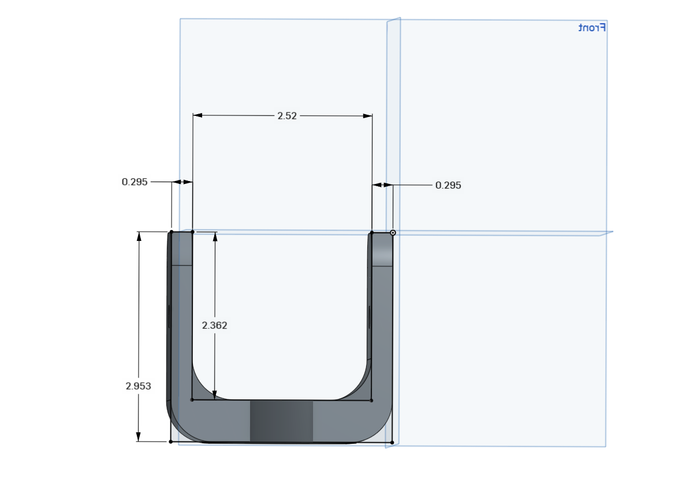

# U-Bracket Optimization Project (Robotic Arm Joint)

This repository shows the modeling and optimization of a U-bracket designed for use as a joint mount in a robotic arm. The primary objective is to improve the mechanical strength and manufacturability of the bracket while maintaining geometric compatibility with the rest of the assembly..

##  Tools Used

- **CAD Software**: Onshape
- **Unit System**: Inch

## Design File
**[Task 3.sldprt](Task%203.sldprt)**

##  Design Images Preview

